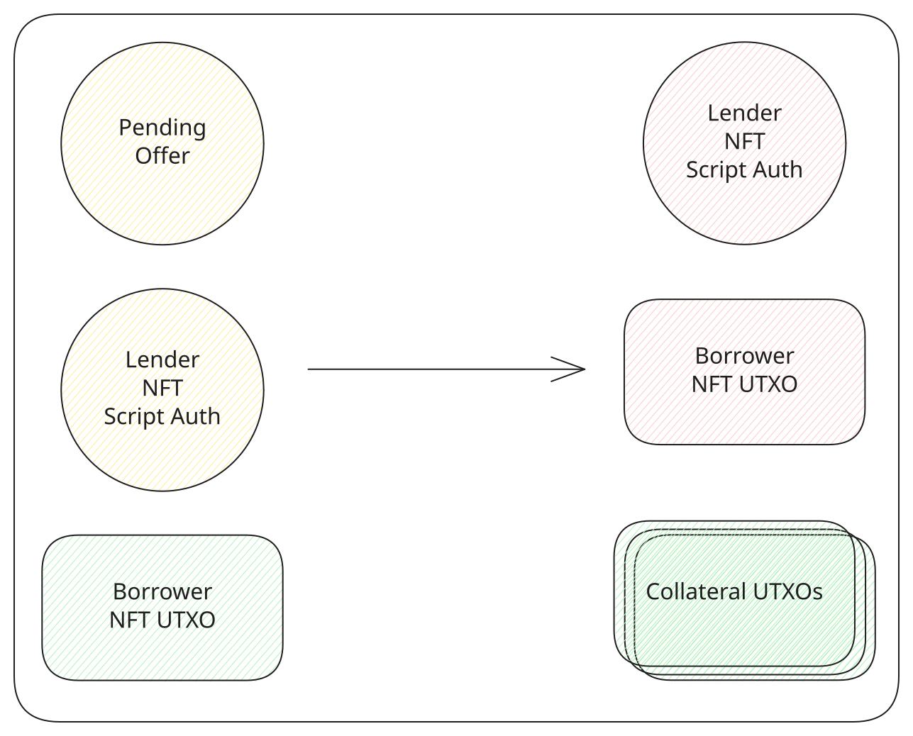

# Cancel an offer

The borrower can cancel an offer while it is still pending and take the collateral back. Funding is not required, and the deadline does not close this action. [Actions](../protocol/actions.md) covers what stays possible after the deadline block.

The transaction spends the pending [lending](../contracts/lending.md) output, the lender NFT held by [script auth](../contracts/script-auth.md), and the borrower NFT from the wallet. Both tokens are burned. The collateral is paid to the borrower. tL-BTC inputs from the wallet pay the network fee, and the remainder comes back.

<TxDiagram>

</TxDiagram>
