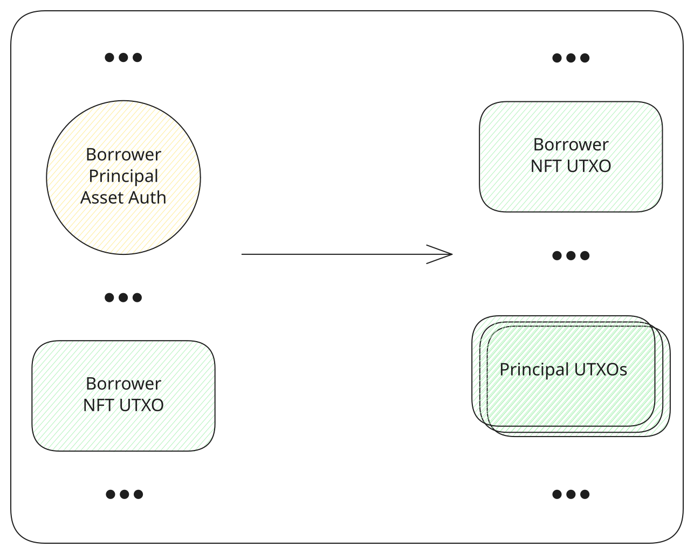

# Claim the principal

When a lender funds the offer, the principal is paid into an output the borrower does not hold yet. It stays locked to the borrower NFT, under [asset auth](../contracts/asset-auth.md), until the borrower claims it. The claim spends that output and the borrower NFT together, pays the principal to the borrower's wallet, and returns the borrower NFT. The token is not burned, because the borrower still needs it to [repay](./repay.md).

The offer has to be active, or already liquidated if the principal was never claimed. Until the claim is done, the app offers no repayment action. A full repayment that confirms before the claim burns the borrower NFT, and this output can no longer be spent, as [Actions](../protocol/actions.md) describes. tL-BTC inputs from the wallet pay the network fee, and the remainder comes back.

<TxDiagram>

</TxDiagram>
