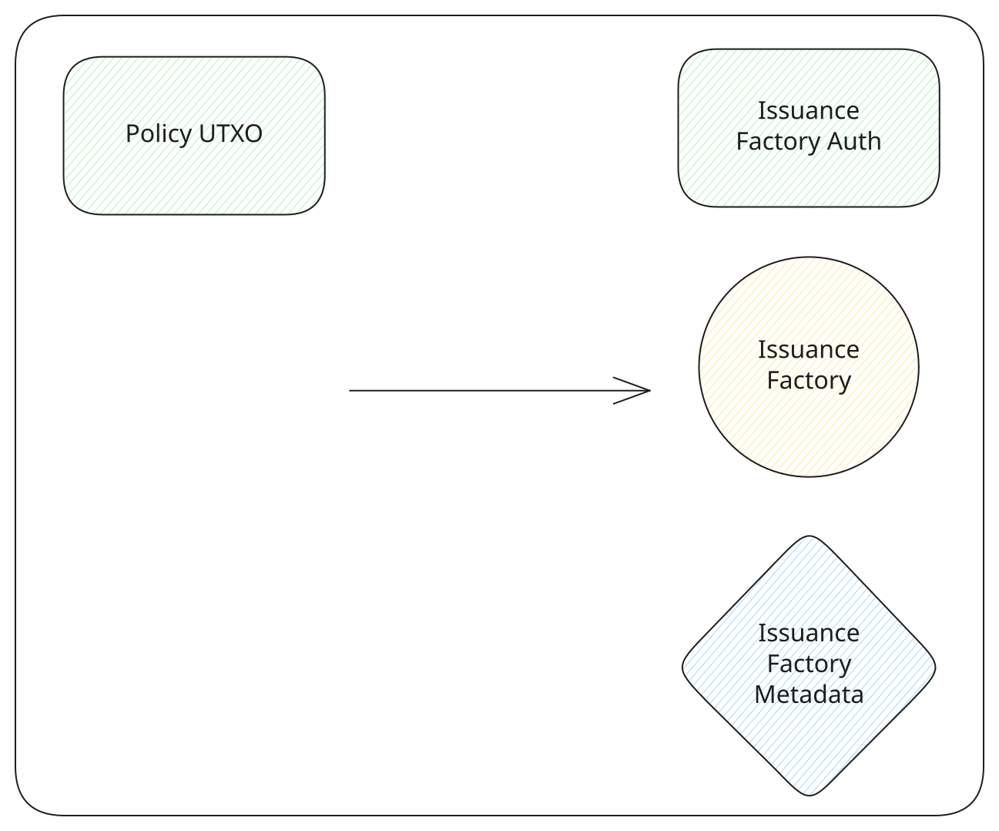

# Create an account

A borrower creates an account before publishing an offer. The account is an [issuance factory](../contracts/issuance-factory.md): one output that can issue the assets later offers need, and a token of the same asset that authorizes it.

The app creates one account for a wallet. The transaction spends a confirmed tL-BTC output from that wallet and issues two units of a new asset, with no reissuance token. One unit goes to the wallet. That is the authorization token, and it has to be present again when the borrower [publishes an offer](./create-offer.md). The other unit goes to the factory output. An `OP_RETURN` on the transaction records the factory's parameters: it will issue two assets at a time, and none of them carry a reissuance token.

Whatever tL-BTC is not spent on the network fee comes back to the wallet. The fee input has to be larger than the reserve the app keeps for that fee.

<TxDiagram>

</TxDiagram>
