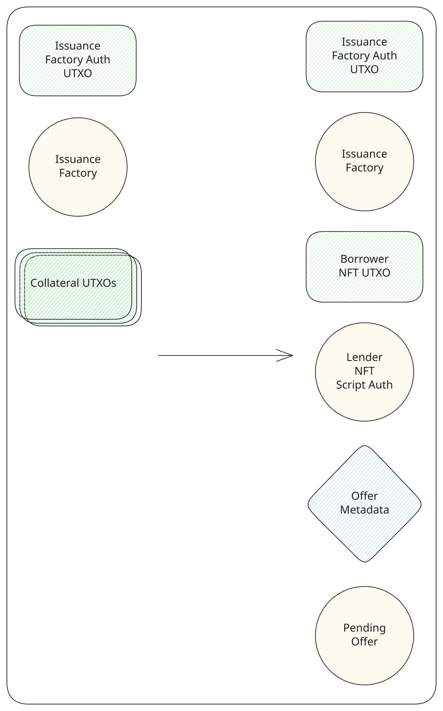
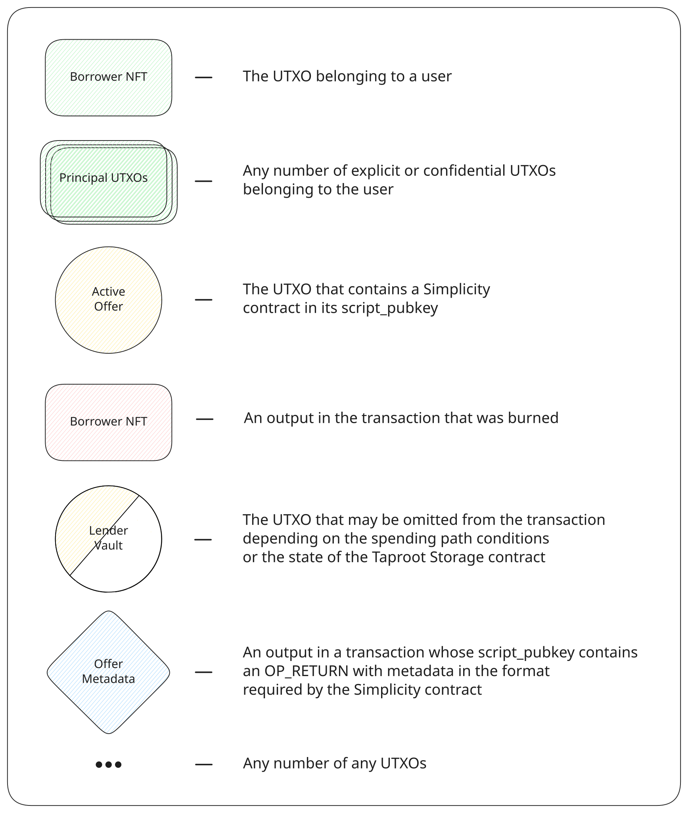

# Create an offer

The borrower publishes an offer and locks the collateral that backs it. The collateral stays in the [lending](../contracts/lending.md) output until the offer is repaid, cancelled, or liquidated. The principal is paid out only after a lender funds the offer.

The borrower needs an [account](./create-account.md) first. The fields fixed by this transaction are the ones in [Offer parameters](../protocol/offer-parameters.md): the collateral amount, the principal, the fee rate, and the deadline. The deadline is the current block height plus the chosen term.

The transaction spends the account's authorization token and the factory output, then recreates both at the same amount. The factory issues the borrower NFT, which goes to the borrower's wallet, and the first collateral input issues the lender NFT. The lender NFT is paid to a [script auth](../contracts/script-auth.md) output bound to this offer, so it can be spent only by a transaction that also spends the offer. The collateral amount is paid into the new lending output. An `OP_RETURN` records the principal asset, the principal amount, the fee rate, and the deadline height.

The collateral inputs are tL-BTC from the wallet, and they also cover the network fee. Anything above the locked collateral comes back to the wallet.

Transaction structure

Legend

