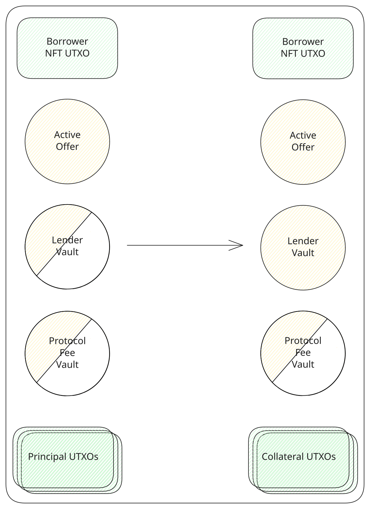
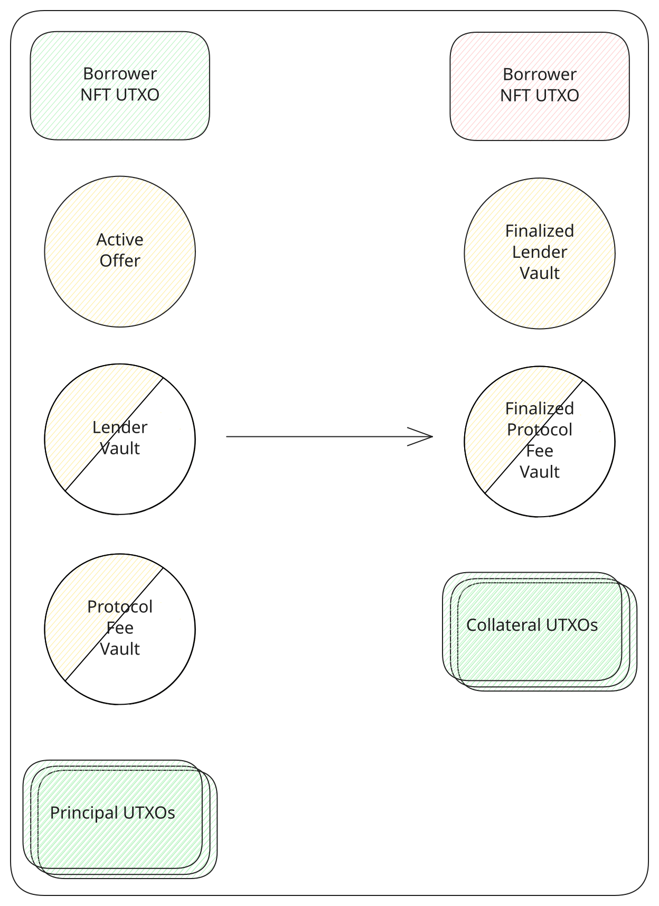

# Repay

Once the loan is active and the principal has been [claimed](./claim-principal.md), the borrower pays the debt down with the principal asset. The fee is settled before the principal. Of the fee paid in a transaction, ten percent goes to the protocol fee vault and the rest goes to the lender's vault, together with any principal in that same payment. [Offer parameters](../protocol/offer-parameters.md) defines the fee, and [asset auth vault](../contracts/asset-auth-vault.md) is the output that holds each share.

A partial repayment pays less than the remaining debt. It spends the borrower NFT and the active [lending](../contracts/lending.md) output. The borrower NFT comes back, and the offer stays active. A share of the collateral, in proportion to the payment against the debt still owed, is paid back to the borrower, and the rest stays locked in the offer. The two vaults are left active. The first payment creates them. A later one spends the vaults already on chain and recreates them.

<TxDiagram>

</TxDiagram>

A full repayment pays whatever debt is left. It spends the same borrower NFT and the active offer. The borrower NFT is burned, and the collateral still in the offer is paid back to the borrower. The lender's vault is finalized. The protocol fee vault is finalized once this payment covers the rest of its share. When the whole debt is paid in a single transaction, both vaults are created already finalized. That is the transaction the app's repay action builds. Any principal above the debt, and the tL-BTC used for the network fee, comes back to the wallet.

<TxDiagram>

</TxDiagram>

After the deadline block, repayment and liquidation are both valid, as [Actions](../protocol/actions.md) describes.
