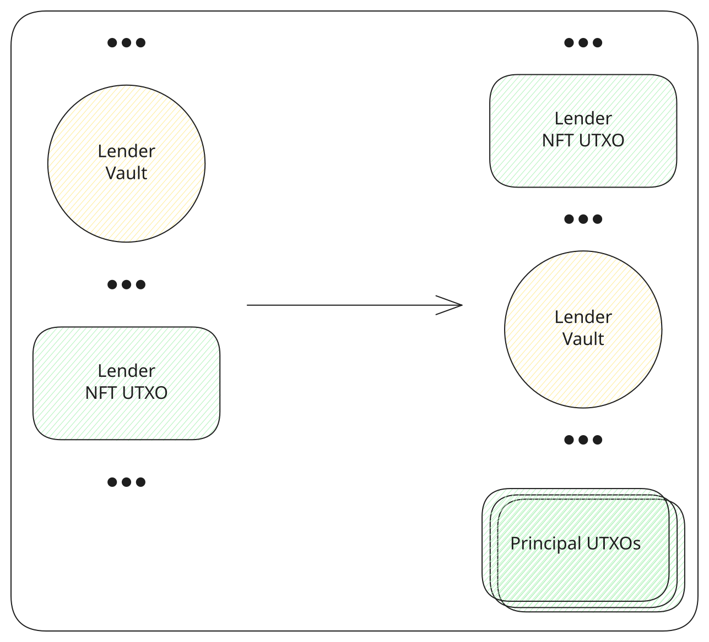
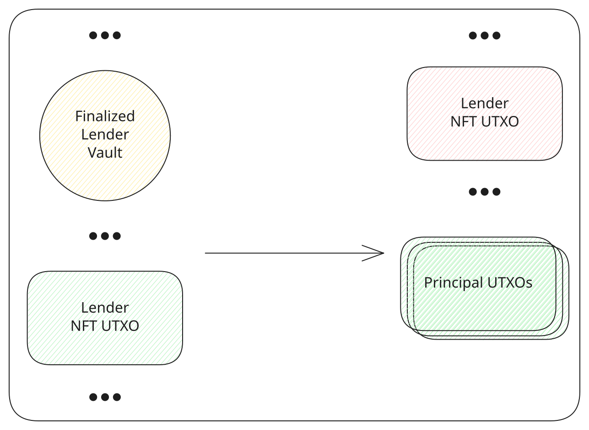

# Claim repayment

The lender's share of each [repayment](../borrower/repay.md) sits in an [asset auth vault](../contracts/asset-auth-vault.md): the lender's part of the fee first, then the principal. The protocol fee stays in its own vault.

A partial claim withdraws less than the balance of an active vault. It spends that vault and the lender NFT. The NFT comes back, and the vault stays active with whatever remains. The withdrawn amount is paid to the lender. The first repayment creates the vault. A later repayment spends it and recreates it, and a partial claim is what takes funds out in between.

<TxDiagram>

</TxDiagram>

A full claim withdraws the whole balance of a finalized vault. It spends that vault and the same lender NFT. The NFT is burned, and the balance is paid to the lender. That is the transaction the app's claim action builds, once the offer is [repaid](../protocol/actions.md). tL-BTC inputs from the wallet pay the network fee, and the remainder comes back.

<TxDiagram>

</TxDiagram>
