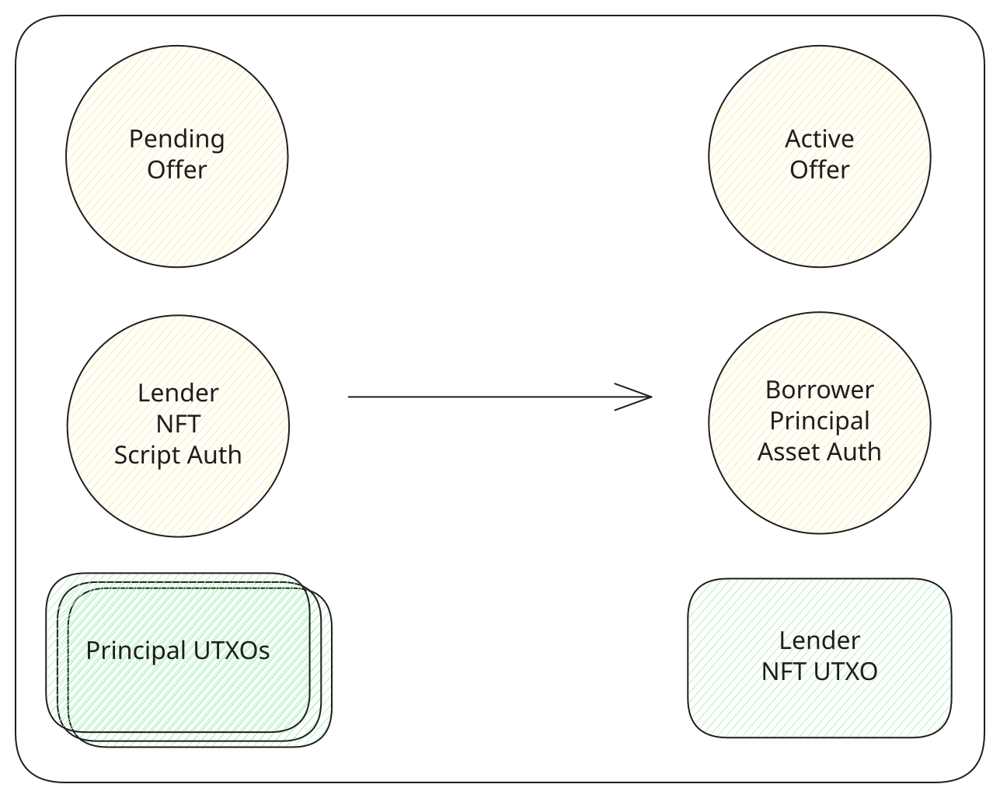

# Fund an offer

A lender funds a pending offer by paying the principal. The offer becomes an active loan. The principal is paid into an [asset auth](../contracts/asset-auth.md) output locked to the borrower NFT, and the borrower [claims it](../borrower/claim-principal.md) from there. The collateral stays in the [lending](../contracts/lending.md) output at the same amount, now marked active.

The transaction spends the pending offer and the lender NFT held by [script auth](../contracts/script-auth.md). The lender NFT is returned to the lender's wallet. From then on it authorizes liquidation and claiming the repayment, as [Roles](../protocol/roles.md) describes. Principal inputs from the wallet cover the amount fixed in [Offer parameters](../protocol/offer-parameters.md). Anything above that amount comes back, and so does the tL-BTC spent on the network fee.

The contract accepts this at any block height. The app hides the action once the deadline block has passed. [Actions](../protocol/actions.md) describes what that leaves open.

<TxDiagram>

</TxDiagram>
