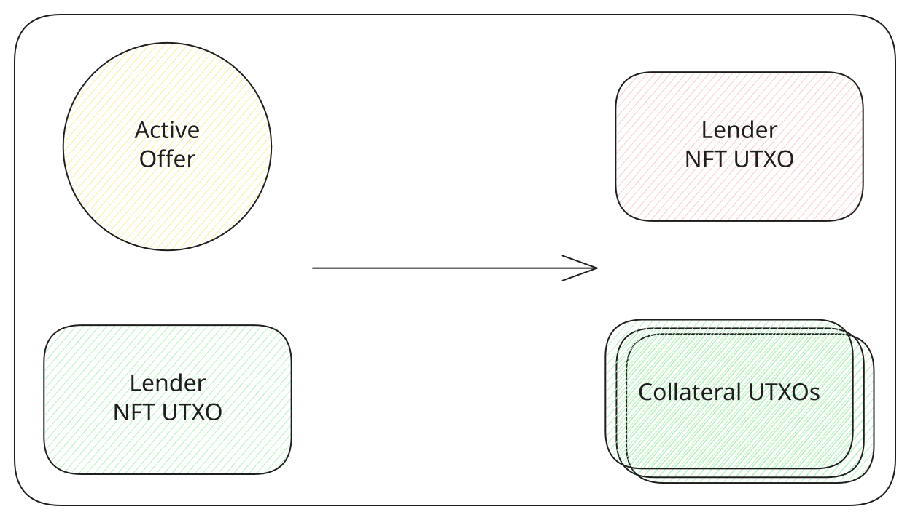

# Liquidate

Once an active loan reaches its deadline block, the lender can take the collateral. This is the only lending path that reads the deadline. Repayment stays valid at the same moment, and [Actions](../protocol/actions.md) describes how the first confirmed transaction wins.

The transaction spends the active [lending](../contracts/lending.md) output and the lender NFT from the wallet. The lender NFT is burned. The collateral still in the offer is paid to the lender. The principal output from funding stays where it is, so the borrower can still [claim it](../borrower/claim-principal.md). tL-BTC inputs from the wallet pay the network fee, and the remainder comes back.

The app offers this action on an active loan after the deadline block.

Transaction structure

Legend

